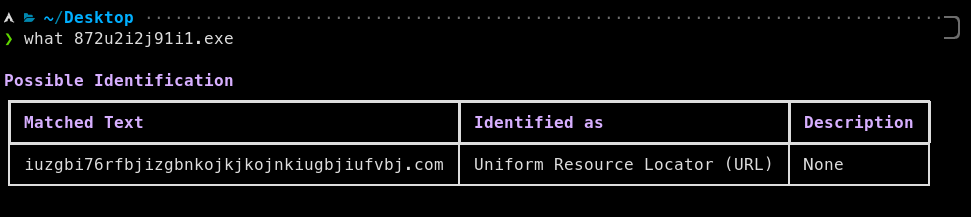
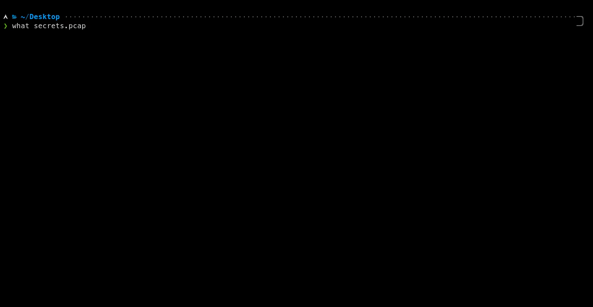

<p align='center'>

<p align="center">➡️ <a href="http://discord.skerritt.blog">Discord</a> ⬅️<br>
<i>The easiest way to identify anything</i><br>
<code>pip3 install pywhat && pywhat --help</code>
</p>

<p align="center">
  <a href="http://discord.skerritt.blog"></a> <a href="https://pypi.org/project/pywhat/"></a>  <a href="https://twitter.com/bee_sec_san"></a> <a href="https://pypi.org/project/pywhat/"></a> <a href="https://pypi.org/project/pywhat/"></a>
</p>
<hr>

# 🤔 `What` is this?


Imagine this: You come across some mysterious text 🧙‍♂️ `0x52908400098527886E0F7030069857D2E4169EE7` or `dQw4w9WgXcQ` and you wonder what it is. What do you do?

Well, with `what` all you have to do is ask `what "0x52908400098527886E0F7030069857D2E4169EE7"` and `what` will tell you!

`what`'s job is to **identify _what_ something is.** Whether it be a file or text! Or even the hex of a file! What about text _within_ files? We have that too! `what` is recursive, it will identify **everything** in text and more!

# Installation

## 🔨 Using pip

```$ pip3 install pywhat```

or

```shell
# installs optional dependencies that may improve the speed
$ pip3 install pywhat[optimize] 
```

## 🔨 On Mac?

```$ brew install pywhat```

Or for our MacPorts fans:

```$ sudo port install pywhat```

# ⚙ Use Cases

## 🦠 Wannacry



You come across a new piece of malware called WantToCry. You think back to Wannacry and remember it was stopped because a researcher found a kill-switch in the code.

When a domain, hardcoded into Wannacry, was registered the virus would stop.

You use `What` to identify all the domains in the malware, and use a domain registrar API to register all the domains.

## 🦈 Faster Analysis of Pcap files



Say you have a `.pcap` file from a network attack. `What` can identify this and quickly find you:

- All URLs
- Emails
- Phone numbers
- Credit card numbers
- Cryptocurrency addresses
- Social Security Numbers
- and much more.

With `what`, you can identify the important things in the pcap in seconds, not minutes.

## 🐞 Bug Bounties

You can use PyWhat to scan for things that'll make you money via bug bounties like:
* API Keys
* Webhooks
* Credentials
* and more

Run PyWhat with:

```
pywhat --include "Bug Bounty" TEXT
```

To do this.

Here are some examples 👇

### 🐙 GitHub Repository API Key Leaks

1. Download all GitHub repositories of an organisation
2. Search for anything that you can submit as a bounty, like API keys

```shell
# Download all repositories
GHUSER=CHANGEME; curl "https://api.github.com/users/$GHUSER/repos?per_page=1000" | grep -o 'git@[^"]*' | xargs -L1 git clone

# Will print when it finds things.
# Loops over all files in current directory.
find . -type f -execdir pywhat --include 'Bug Bounty' {} \;
```

### 🕷 Scan all web pages for bounties

```shell
# Recursively download all web pages of a site
wget -r -np -k https://skerritt.blog

# Will print when it finds things.
# Loops over all files in current directory.
find . -type f -execdir pywhat --include 'Bug Bounty' {} \;
```

**PS**: We support more filters than just bug bounties! Run `pywhat --tags`

## 🌌 Other Features

Anytime you have a file and you want to find structured data in it that's useful, `What` is for you.

Or if you come across some piece of text and you don't know what it is, `What` will tell you.

### 📁 File & Directory Handling

**File Opening** You can pass in a file path by `what 'this/is/a/file/path'`. `What` is smart enough to figure out it's a file!

What about a whole **directory**? `What` can handle that too! It will **recursively** search for files and output everything you need!

### 🔍 Filtering your output

Sometimes, you only care about seeing things which are related to AWS. Or bug bounties, or cryptocurrencies!

You can filter output by using `what --rarity 0.2:0.8 --include Identifiers,URL https://skerritt.blog`. Use `what --help` to get more information.

To see all filters, run `pywhat --tags`! You can also combine them, for example to see all cryptocurrency wallets minus Ripple you can do:

```console
pywhat --include "Cryptocurrency Wallet" --exclude "Ripple Wallet" 1KFHE7w8BhaENAswwryaoccDb6qcT6DbYY
```

### 👽 Sorting, Exporting, and more!

**Sorting** You can sort the output by using `what -k rarity --reverse TEXT`. Use `what --help` to get more information.

**Exporting** You can export to json using `what --json` and results can be sent directly to a file using `what --json > file.json`.

**Boundaryless mode** `What` has a special mode to match identifiable information within strings. By default, it is enabled in CLI but disabled in API. Use `what --help` or refer to [API Documentation](https://github.com/bee-san/pyWhat/wiki/API) for more information.


# 🍕 API

PyWhat has an API! Click here [https://github.com/bee-san/pyWhat/wiki/API](https://github.com/bee-san/pyWhat/wiki/API) to read about it.

# 👾 Contributing

`what` not only thrives on contributors, but can't exist without them! If you want to add a new regex to check for things, you can read our documentation [here](https://github.com/bee-san/what/wiki/Adding-your-own-Regex)

We ask contributors to join the Discord for quicker discussions, but it's not needed:
<a href="http://discord.skerritt.blog"></a>

# 🙏 Thanks

We would like to thank [Dora](https://github.com/sdushantha/dora) for their work on a bug bounty specific regex database which we have used.