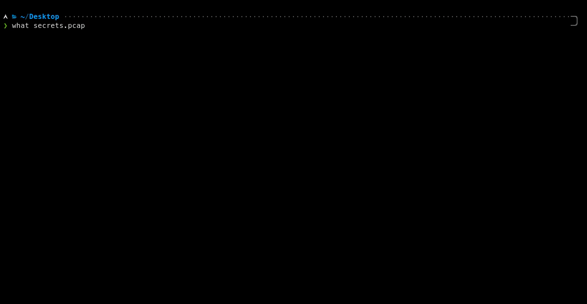

➡️ <a href="http://discord.skerritt.blog">Discord</a> ⬅️ 
<i>The easiest way to identify anything</i> 
<code>pip3 install pywhat && pywhat --help</code>

       

# 🤔 `What` is this?

Imagine this: You come across some mysterious text 🧙‍♂️ `5f4dcc3b5aa765d61d8327deb882cf99` and you wonder what it is. What do you do?

Well, with `what` all you have to do is ask `what "5f4dcc3b5aa765d61d8327deb882cf99"` and `what` will tell you!

`what`'s job is to **identify _what_ something is.** Whether it be a file or text! Or even the hex of a file! What about text _within_ files? We have that too! `what` is recursive, it will identify **everything** in text and more! 

# ⚙ Use Cases

## 🦠 Wannacry

You come across a new piece of malware called WantToCry. You think back to Wannacry and remember it was stopped because a researcher found a kill-switch in the code.

When a domain, hardcoded into Wannacry, was registered the virus would stop.

You use `What` to identify all the domains in the malware, and use a domain registrar API to register all the domains. If Wannacry happens again, you can stop it in minutes - not weeks.

## 🦈 Faster Analysis of Pcap files

Say you have a `.pcap` file from a network attack. `What` can identify this and quickly find you:
* All hashes
* Credit card numbers
* Cryptocurrency addresses
* Social Security Numbers
* and much more.

With `what`, you can identify the important things in the pcap in seconds, not minutes.

## 🌌 Anything

Anytime you have a file and you want to find structured data in it that's useful, `What` is for you.

Or if you come across some piece of text and you don't know what it is, `What` will tell you.

**File Opening** You can pass in a file path by `what "this/is/a/file/path"`. What is smart enough to figure out it's a file!

**Filtration** You can filter output by using `what --rarity 0.2:0.8 --include_tags tag1,tag2 TEXT`. Use `what --help` to get more information.

# 🍕 API

PyWhat has an API! Click here [https://github.com/bee-san/pyWhat/wiki/API](https://github.com/bee-san/pyWhat/wiki/API) to read about it.

# 👾 Contributing

`what` not only thrives on contributors, but can't exist without them! If you want to add a new regex to check for things, you can read our documentation [here](https://github.com/bee-san/what/wiki/Adding-your-own-Regex)

We ask contributors to join the Discord for quicker discussions, but it's not needed:

